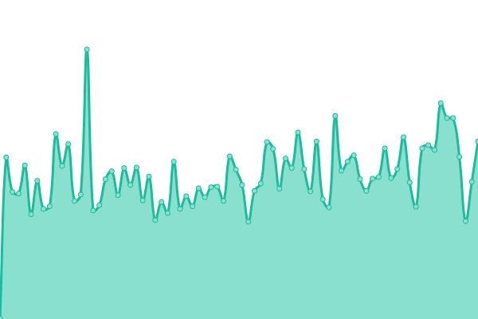
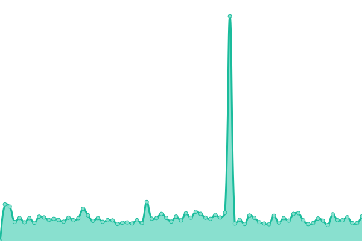
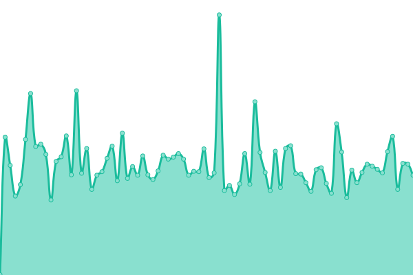
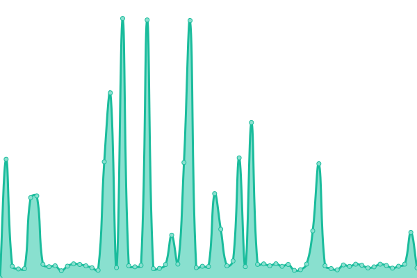
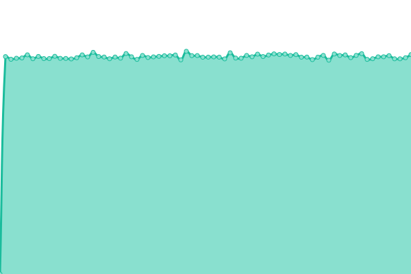
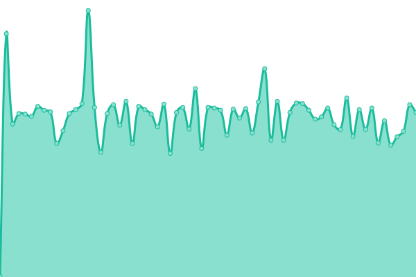

# [📈 Live Status](https://status.eservice-hk.com): <!--live status--> **🟩 All systems operational**

This repository contains the open-source uptime monitor and status page for [HKLCF](https://::1/), powered by [Upptime](https://github.com/upptime/upptime).

With [Upptime](https://upptime.js.org), you can get your own unlimited and free uptime monitor and status page, powered entirely by a GitHub repository. We use [Issues](https://github.com/hklcf/upptime/issues) as incident reports, [Actions](https://github.com/hklcf/upptime/actions) as uptime monitors, and [Pages](https://status.eservice-hk.com) for the status page.

<!--start: status pages-->
<!-- This summary is generated by Upptime (https://github.com/upptime/upptime) -->
<!-- Do not edit this manually, your changes will be overwritten -->
<!-- prettier-ignore -->
| URL | Status | History | Response Time | Uptime |
| --- | ------ | ------- | ------------- | ------ |
|  [eService-HK.com](https://eservice-hk.com) | 🟩 Up | [e-service-hk-com.yml](https://github.com/hklcf/upptime/commits/HEAD/history/e-service-hk-com.yml) | 

 300ms
     
 | 

<a href="https://status.eservice-hk.com/history/e-service-hk-com">100.00%</a>
    

|  [eService-HK.net](https://eservice-hk.net) | 🟩 Up | [e-service-hk-net.yml](https://github.com/hklcf/upptime/commits/HEAD/history/e-service-hk-net.yml) | 

 621ms
     
 | 

<a href="https://status.eservice-hk.com/history/e-service-hk-net">100.00%</a>
    

|  Hosting 01 | 🟩 Up | [hosting-01.yml](https://github.com/hklcf/upptime/commits/HEAD/history/hosting-01.yml) | 

 482ms
     
 | 

<a href="https://status.eservice-hk.com/history/hosting-01">100.00%</a>
    

|  Hosting 02 | 🟩 Up | [hosting-02.yml](https://github.com/hklcf/upptime/commits/HEAD/history/hosting-02.yml) | 

 299ms
     
 | 

<a href="https://status.eservice-hk.com/history/hosting-02">100.00%</a>
    

|  Bot | 🟩 Up | [bot.yml](https://github.com/hklcf/upptime/commits/HEAD/history/bot.yml) | 

 499ms
     
 | 

<a href="https://status.eservice-hk.com/history/bot">100.00%</a>
    

|  Clients | 🟩 Up | [clients.yml](https://github.com/hklcf/upptime/commits/HEAD/history/clients.yml) | 

 592ms
     
 | 

<a href="https://status.eservice-hk.com/history/clients">100.00%</a>
    

|  [img.eservice-hk.net](https://img.eservice-hk.net) | 🟩 Up | [img-eservice-hk-net.yml](https://github.com/hklcf/upptime/commits/HEAD/history/img-eservice-hk-net.yml) | 

 295ms
     
 | 

<a href="https://status.eservice-hk.com/history/img-eservice-hk-net">100.00%</a>
    

<!--end: status pages-->

[**Visit our status website →**](https://status.eservice-hk.com)

## 📄 License

- Powered by: [Upptime](https://github.com/upptime/upptime)
- Code: [MIT](./LICENSE) © [HKLCF](https://::1/)
- Data in the `./history` directory: [Open Database License](https://opendatacommons.org/licenses/odbl/1-0/)
